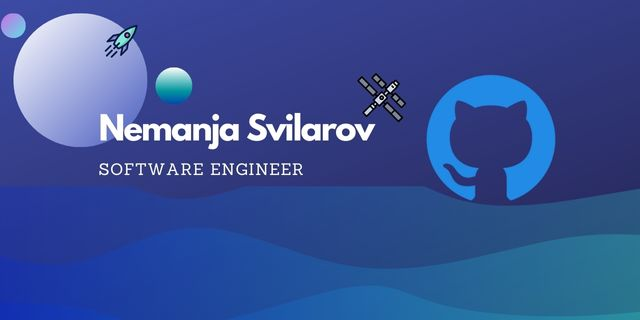

### Hello there, I'm Nemanja Svilarov :vulcan_salute:

I'm a Software Engineer that is passionate about programming. I'm always looking for new technologies to add to my stack. You can look through my repositories if you're interested to see what I have built.

#

### Languages and Tools 

  

#

### Status

#

  
<h3>My Coding Journey :computer:</h3>

  My passion for programming started in highschool. The first programming language that intruduced me to programming was C. I knew that programming was my call and    that is why I joined university. Since then I had an opportunity to code in many programming languages. I've worked in C, Assembly, C++, C#, PHP, Java, JavaScript, and Python. Java was the language that help me understand OOP, and it was the first language that I wanted to explore in more depth. After Java I started to explore C# which led me to apply for an internship in .Net. Project that I had to complete during the internship was full stack web app written in .Net and React. React was a little tougher for me because my JavaScript was a little rusty at the time. After the internship I wanted to know more about JavaScript. I started my JavaScript journey, and I must admit I feel in love with the language. In the last year I've learned JavaScript, Node, and React. I can't wait to see what's next in store for me.

